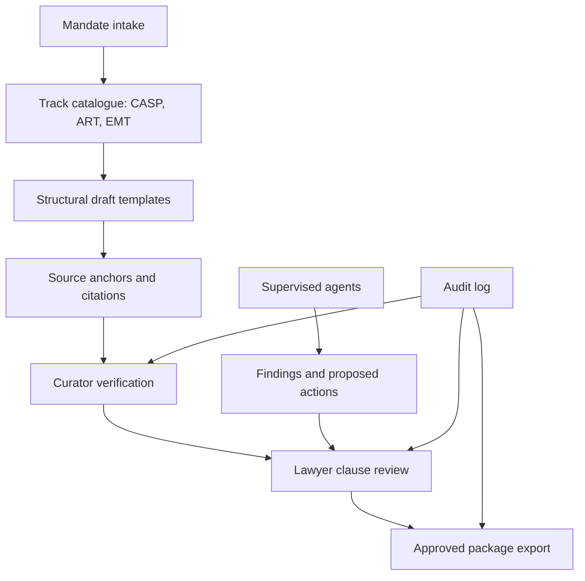

# Launch Readiness

This document makes the repository easy to evaluate quickly. It explains what the project proves, how to run it, what demo path to use, which checks matter and which safety limits apply.

## What this repo proves

MiCAR Authorization Co-Pilot translates regulated crypto-asset authorisation work into a review-gated software workflow. It demonstrates structured intake, source-grounded drafting, citation verification, lawyer approval, auditability and export packaging for CASP, ART and EMT mandates.

The strongest evaluation signal is not autonomous drafting. The strongest signal is disciplined legal workflow architecture: official source ingestion, curator verification, review states, redaction controls, clause approval and export gates.

## Architecture



## Local launch path

```bash
make install
make install-frontend
make db-up

cp .env.example backend/.env
cp frontend/.env.local.example frontend/.env.local

make migrate
cd backend && uv run python -m micar.anchors.ingest seed
cd backend && uv run python -m micar.anchors.ingest eurlex --regulation 2023/1114
cd backend && uv run python -m micar.anchors.ingest eurlex-level2
cd backend && uv run python -m micar.anchors.ingest eba-guidelines

make dev-backend
make dev-frontend
```

Set the same `JWT_SHARED_SECRET` in backend and frontend env files. Set `AUTH_SECRET` in `frontend/.env.local`. Use `ALLOW_UNRESTRICTED_DEV_AUTH=true` only for disposable local development.

## Demo path

1. Start Postgres, backend and frontend.
2. Create a local development user.
3. Create a synthetic CASP, ART or EMT mandate.
4. Complete intake sections with non-confidential sample facts.
5. Generate structural drafts.
6. Verify source anchors in the anchor library.
7. Review and approve clauses.
8. Export the approved package.
9. Open the supervised agent run history and audit trail.

## Checks

```bash
make test
make e2e
make lint
make typecheck
make build-frontend
```

For browser tests:

```bash
cd frontend && npx playwright install chromium
```

## Sample data rule

Use only synthetic issuer, token, service, outsourcing, shareholder and governance facts. Do not load confidential client mandates, privileged correspondence or production filing material into a local or external model workflow.

## Safety posture

This is a supervised legal-engineering prototype. It does not certify current BaFin practice and does not produce filing-ready applications without lawyer review. External LLM processing must stay disabled unless confidentiality, professional-secrecy, data-protection and source-verification approvals are documented.

## Good evaluator route

A reviewer should first read the README, then inspect this file, `docs/PLAN.md`, the track catalogues, the source-anchor ingestion code, the agent layer and the export gate. The key question is whether the workflow makes the safe path the easy path.